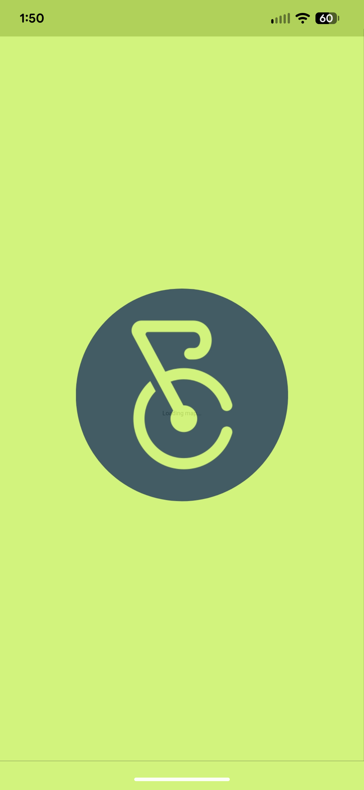
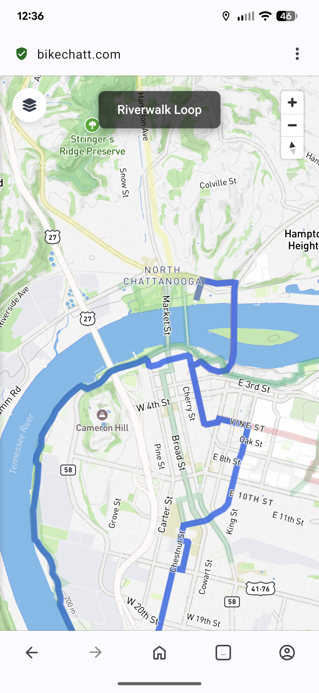

# Chattanooga Bike Map

An interactive map showcasing bike routes, bike share stations, attractions, and bike resources in Chattanooga, TN. Built with love by [iFixit](https://www.ifixit.com) for the Chattanooga cycling community.

<p align="center">
  
  
</p>

## Features

- **Curated Bike Routes**: Explore popular routes including the Riverwalk Loop, Zoo Loop, and local greenways
- **Real-time Bike Share Data**: Live availability for Chattanooga's bike share stations via GBFS API
- **Points of Interest**: Discover attractions, bike shops, and local resources
- **Mobile-First Design**: Optimized for on-the-go route planning with PWA support
- **Interactive Map**: Powered by Mapbox with custom styling and route visualization

## Data Sources

- **Bike Share Stations**: [Chattanooga Bike Share GBFS API](https://chattanooga.publicbikesystem.net/customer/ube/gbfs/v1/)
- **Mapping**: [Mapbox GL JS](https://www.mapbox.com/mapbox-gljs)
- **Bike Routes**: Custom curated routes from local cycling community

## Getting Started

### Prerequisites

- Node.js 20+
- pnpm 10+ (recommended) or npm

### Installation

1. Clone the repository:
```bash
git clone https://github.com/kwiens/bikemap.git
cd bikemap
```

2. Install dependencies:
```bash
pnpm install
```

3. Set up environment variables (MapBox secret key):
```bash
cp .env.example .env.local
# Add your Mapbox token if using a custom one
```

4. Run the development server:
```bash
pnpm dev
```

5. Open [http://localhost:3000](http://localhost:3000) to view the map

### Development Scripts

- `pnpm dev` - Start development server
- `pnpm build` - Build for production
- `pnpm start` - Start production server
- `pnpm test` - Run tests in watch mode
- `pnpm test:run` - Run tests once
- `pnpm lint` - Check code quality
- `pnpm lint:fix` - Auto-fix linting issues

## Running Tests

The project includes comprehensive test coverage for critical features:

```bash
# Run all tests
pnpm test:run

# Run tests in watch mode
pnpm test
```

Test coverage includes:
- GBFS API integration (bike share data fetching)
- Mapbox geocoding and geospatial utilities
- Route calculations and mapping functions

## Project Structure

```
bikemap/
├── src/
│   ├── app/              # Next.js app directory
│   ├── components/       # React components
│   │   ├── ui/          # Reusable UI components
│   │   ├── Map.tsx      # Main map component
│   │   └── MapMarkers.tsx
│   ├── data/            # Data sources and types
│   │   ├── gbfs.ts      # Bike share API integration
│   │   └── geo_data.ts  # Routes, attractions, resources
│   ├── utils/           # Utility functions
│   └── hooks/           # React hooks
├── public/              # Static assets
├── tests/               # Test setup and utilities
└── .github/workflows/   # CI/CD workflows
```

## Contributing

We welcome contributions from the community! Whether you're fixing bugs, adding features, or improving documentation, your help makes this project better for everyone.

### How to Contribute

1. **Fork the repository**
2. **Create a feature branch** (`git checkout -b feature/amazing-feature`)
3. **Make your changes** and add tests if applicable
4. **Run tests and linting** (`pnpm test:run && pnpm lint`)
5. **Commit your changes** (`git commit -m 'Add amazing feature'`)
6. **Push to your branch** (`git push origin feature/amazing-feature`)
7. **Open a Pull Request**

### Reporting Issues

Found a bug or have a feature request? Please [open an issue](https://github.com/kwiens/bikemap/issues) with:
- A clear description of the problem or suggestion
- Steps to reproduce (for bugs)
- Screenshots if applicable
- Your environment (browser, OS, etc.)

### Code of Conduct

This project is dedicated to providing a welcoming and inclusive experience for everyone. Please be respectful and constructive in all interactions.

## Tech Stack

- **Framework**: [Next.js](https://nextjs.org/) (React)
- **Styling**: [Tailwind CSS](https://tailwindcss.com/)
- **Mapping**: [Mapbox GL JS](https://www.mapbox.com/mapbox-gljs)
- **UI Components**: [Radix UI](https://www.radix-ui.com/)
- **Icons**: [Font Awesome](https://fontawesome.com/)
- **Testing**: [Vitest](https://vitest.dev/)
- **Package Manager**: [pnpm](https://pnpm.io/)
- **Linting**: ESLint + [Biome](https://biomejs.dev/)

## Dedication

This project is dedicated to the memory of our friend and collaborator Yoseph. In his honor, consider donating to [Yoseph's Bikes](https://www.whiteoakbicycle.org/yoyobikes) to help children access the joy of riding.

## License

This project is open source and available under the [MIT License](LICENSE).

## Acknowledgments

- Thanks to the Chattanooga cycling community for route curation and feedback
- [Bike Chattanooga](https://bikechatt.com) for providing bike share infrastructure
- [iFixit](https://www.ifixit.com) for supporting open-source community projects

---

Made with ❤️ in Chattanooga, TN
